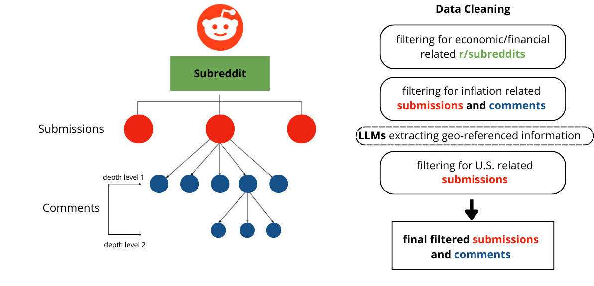
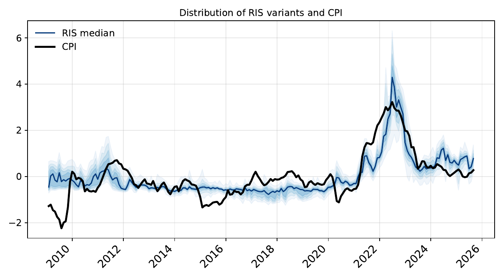
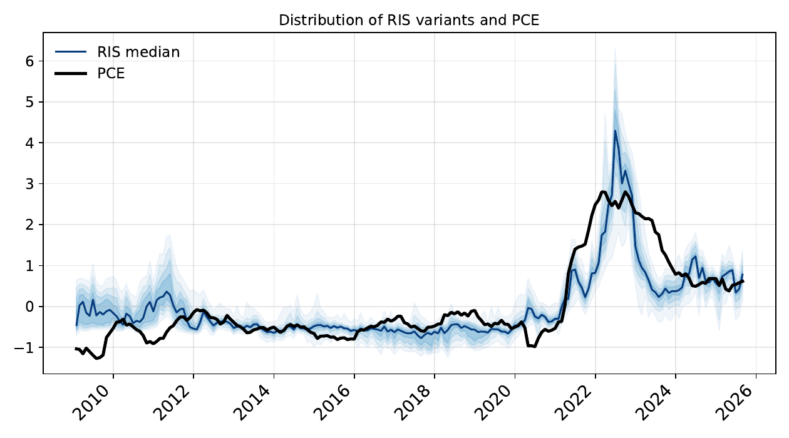

# Reddit's Pulse on US Inflation

Replication code for *Reddit's Pulse on US Inflation: Forecasting with Large
Language Models*.

We read inflation narratives off Reddit with fine-tuned large language models,
turn them into daily indicators, and evaluate whether they help forecast and
nowcast US inflation.

<p align="center">
  
</p>

Submissions and their comment trees are filtered down to US, inflation-related
content in economics and finance subreddits. Each item is labelled by an LLM,
the labels are aggregated into a daily signal per subreddit, and those signals
enter an AR-X(1) forecasting model.

Indicators chart is shown below:

<p align="center">
  
  
</p>

Everything runs on the aggregated data shipped in `data/`. Reddit conversations
are not needed to reproduce the results.

## Quick start

```bash
python -m pip install -r requirements.txt
bash run_all.sh          # every result, table and figure (~2h30 on 2 cores)
```

`run_all.sh` writes model output to `results/` and `data_fed_nowcast/`, then
calls `paper_objects.py`, which prints the tables of the main text and saves its
figures to `figures_paper/`.

To redo only the tables and figures from results already on disk (a few
seconds):

```bash
python paper_objects.py              # prints the tables, shows and saves the figures
python paper_objects.py --no-show    # save the figures without opening them
```

To run a single step:

```bash
cd forecast_codes
python new_codes.py                          # fine-tuned LLM signals, core PCE
python new_codes.py --target CPIAUCSL
python new_codes_llama70B.py                 # Llama-3.3-70B signals
python new_codes_sentiments.py               # TextBlob / VADER / Loughran-McDonald
python check_results_forecast.py --target CPIAUCSL --export --mad --mae

cd ../nowcast_codes
python new_codes_real_time.py --target PCEPILFE --cutoffs 5 10 14 22 --save
python new_codes_real_time_llama70B.py --target PCEPILFE --cutoffs 5 10 14 22 --save
python nowcast_charts.py                     # comparison with the Cleveland Fed nowcast
```

Common flags: `--target {PCEPILFE,CPIAUCSL}`, `--horizons 1 6 12`,
`--cutoffs 5 10 14 22`, `--data`, `--out`, `--tag`, `--fred-key`.

## What is in the repository

```
data/              the aggregated inputs (see below)
data_fed_nowcast/  Cleveland Fed inflation nowcast files, an input
forecast_codes/    the multi-horizon forecasting exercise
nowcast_codes/     the within-month nowcasting exercise
paper_objects.py   rebuilds the tables and figures of the main text in one pass
run_all.sh         runs everything end to end
_build/            how data/ was produced from the raw Reddit files
```

`results/`, `figures/`, `figures_paper/` and `logs/` are created by the scripts
and are not tracked.

## data/

| file | content |
|---|---|
| `df_jae_reddit.xlsx` | monthly dataset: CPI and core PCE (levels and 12-month log changes), the Michigan survey, the 1-year inflation swap, and every Reddit signal at the moving-average windows used in the paper (`_ma1` … `_ma360`) |
| `daily_signals_finetuned.csv` | daily signals from the six fine-tuned model families, by subreddit |
| `daily_signals_llama70b.csv` | daily signals from Llama-3.3-70B, by subreddit |
| `daily_signals_sentiment.csv` | daily lexicon sentiment scores, by subreddit |
| `daily_signals_rt_finetuned.csv` | the same fine-tuned signals under the **real-time** aggregation used for the nowcast |
| `daily_signals_rt_llama70b.csv` | the same, for Llama-3.3-70B |
| `CPIAUCSL_2.xlsx`, `PCEPILFE_2.xlsx` | ALFRED real-time vintages of the target, used by the nowcast |
| `mcs/test_mcs_1000_{h}_{target}_new.xlsx` | Model Confidence Set at each horizon (B = 1,000): the models left in the set and their p-values |

The daily CSVs are counts and averages of model labels — one number per
subreddit per day — so they contain no Reddit text.

The two aggregations differ on purpose. For the **forecast**, a thread is dated
at the submission date and its signal is the mean over all its items. For the
**nowcast**, every item enters at its own date and the thread signal is an
expanding mean of the items available up to *t*, so no comment is backdated to
the submission.

The macro block (CPIAUCSL, PCEPILFE, MICH, EXPINF1YR, 2002-01 to 2025-08) is
frozen inside `df_jae_reddit.xlsx`, so the scripts run offline and no API key is
needed. CPI is taken from the ALFRED vintage of 11 September 2025, the one
behind the published results; later vintages revise CPI from 2021 onward and
move some CPI ratios in the third decimal. Passing `--fred-key YOUR_KEY` pulls
the current vintage instead, with the same caveat. A free key is available at
<https://fred.stlouisfed.org/docs/api/api_key.html>.

Quick look at the data:

```python
import pandas as pd, matplotlib.pyplot as plt
from scipy.stats import zscore

df = pd.read_excel('data/df_jae_reddit.xlsx', index_col=0, parse_dates=True)
cols = [c for c in df.columns if 'trend' in c and c.endswith('_ma90')]

sub = df.loc['2009':, ['inflation_cpi'] + cols].dropna()
z = pd.DataFrame(zscore(sub), columns=sub.columns, index=sub.index)

fig, ax = plt.subplots(figsize=(10, 4))
for c in cols:
    ax.plot(z.index, z[c], lw=1, alpha=0.4)
ax.plot(z.index, z['inflation_cpi'], color='black', lw=2.5, label='CPI')
ax.legend(frameon=False); ax.grid(alpha=0.3); plt.tight_layout(); plt.show()
```

Replace `'trend'` with `'llama70'` for the Llama-70B signals, and
`inflation_cpi` with `inflation_pce` for the core PCE target.

## paper_objects.py

Reproduces the tables and figures of the main text of the paper. Tables are
printed as text and as LaTeX; figures are saved in `figures_paper/` under the
file names the manuscript uses.

## forecast_codes/

- `new_codes.py` — multi-horizon forecasts from the fine-tuned LLM signals
- `new_codes_llama70B.py` — the same from Llama-3.3-70B
- `new_codes_sentiments.py` — the same from the lexicon sentiment models
- `check_results_forecast.py` — RMSE / MAE / MAD ratios against the AR
  benchmark with Diebold–Mariano tests, and the fluctuation-test chart at every
  horizon
- `forecast_charts.py` — Figures 6 and 7 (CSSED and fluctuation test)
- `mcs_figures.py` — Figure 8. Reads the MCS results in `data/mcs/`, classifies
  every model in the set by family, subreddit and moving-average window, writes
  the summary workbooks `results/test_MCS/mcs-summary-{cpi,pce}-h1-h18.xlsx`,
  checks that the counts reconcile with the member lists, and draws the heatmap
- `_common.py` — data loaders, Diebold–Mariano test, fluctuation test,
  discounted-MSFE combination. The nowcast scripts import it from here.

## nowcast_codes/

- `new_codes_real_time.py` — real-time nowcasts from the fine-tuned signals
- `new_codes_real_time_llama70B.py` — the same from Llama-3.3-70B (it imports
  the estimation loop from the script above; the two differ only in the input
  file and the output names)
- `nowcast_charts.py` — comparison against the Cleveland Fed nowcast: RMSE and
  MAE ratios against AR(1) at every cutoff, with Diebold–Mariano stars, and
  Figures 9 and 10

A cutoff is the day of month *t+1* up to which Reddit content is used. CPI is
released mid-month, so only +5, +10 and +14 keep that content strictly prior to
the release; PCE is released later and also allows +22.

Run the cutoffs of a target in one go. In the original notebooks `ma_window` is
initialised outside the cutoff loop, so from the second cutoff on the signal
levels stored in `all_models_*.csv` use a 30-day window rather than 90. No
regression uses those columns, but the behaviour is reproduced so the saved
files match; `--ma-init 30` lets you resume at a later cutoff.

## _build/

Scripts that need the raw labelled Reddit files and therefore cannot be run from
this repository. They are kept for transparency: the aggregation code is exactly
what produced the CSVs in `data/`.

- `build_daily_signals.py` — the three forecast daily CSVs
- `build_daily_signals_realtime.py` — the two nowcast daily CSVs

## Fine-tuning

Code for fine-tuning the models used in the paper:
<https://github.com/andrea-dm/reddit-pulse>.
